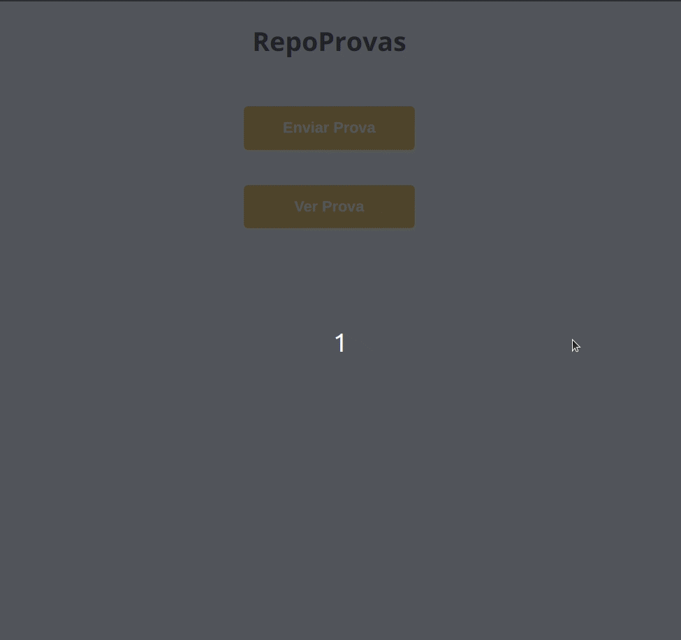

<h1 align="center">
     📝 <a href="#" alt="site do ecoleta">RepoProvas</a>
</h1>

<h3 align="center">
    📝 Seu app preferido para encontrar as provas antigas dos professores e se preparar melhor! 
</h3>

---

<h4 align="center">
	🚧   Concluído 🚀 🚧
</h4>

---
  
Tabela de conteúdos
=================
<!--ts-->
   * [Sobre o projeto](#-sobre-o-projeto)
   * [Funcionalidades](#-funcionalidades)
   * [Como executar o projeto](#-como-executar-o-projeto)
     * [Pré-requisitos](#pré-requisitos)
     * [Rodando a aplicação web (Frontend)](#frontend)
   * [Tecnologias](#-tecnologias)
     * [WebSite](#Website)
   * [Autor](#-autor)
<!--te-->

## 💻 Sobre o projeto
 

📝 RepoProvas é um repositório de provas onde os alunos podem postar suas provas antigas e ajudar toda a comunidade a se preparar melhor paras as provas na faculdade! 

Projeto desenvolvido durante a **Formação Driven** oferecida pela [Driven Education](https://www.driven.com.br/?utm_source=search&utm_medium=google-ads&utm_campaign=branding&gclid=Cj0KCQiA7oyNBhDiARIsADtGRZa8cqYastMgHzxSP4gfGdixu6ib79VG7zi6xrecJNkRGD1D2Ap7k20aAuxIEALw_wcB).
Durante as semanas de projeto na formação Driven, os instrutores passam os requisitos que o projeto deve atingir, porém todo o código da aplicação é desenvolvido pelo autor [Paulo Piotto](https://github.com/Paulo-Piotto)

---

## ⚙️ Funcionalidades

- [x] Ná página inicial o usuário pode escolher entre enviar uma nova prova ou ver uma prova.
- [x] Caso escolher enviar uma nova prova, o usuário precisa preencher os dados desse prova, que são:
    - Nome
    - Categoria, que só pode ser: P1/P2/P3/2ch/Outras
    - Disciplina
    - Professor
    - URL para o PDF da prova
- [x] Agora, pra quem entra na plataforma querendo visualizar uma prova, tem duas opções:
    - listar as provas por professor
    - listar as provas por disciplina
- [x] Se escolher por professor, aparece uma lista com todos os professores cadastrados, indicando a quantidade de provas de cada um. Ao escolher então um professor, aparecem suas provas separadas por tipo (P1, P2, etc). Cada prova tem o nome e a disciplina, e quando clicadas abrem o link do pdf.
- [x] Já se a pessoa escolher ver as provas por disciplina, é um comportamento semelhante. Ao clicar então em uma disciplina, são exibidas as provas agrupadas por tipo (P1, P2, etc), com o nome da prova e do professor que aplicou. Ao clicar na prova, abre-se o link do pdf.

---

## 🚀 Como executar o projeto

Este projeto é divido em duas partes:
1. Backend (https://github.com/Paulo-Piotto/repoProvas-back) 
2. Frontend (https://github.com/Paulo-Piotto/repoProvas-front)

O deploy do Backend foi realizado na plataforma gratuita Heroku, e o deploy do Frontend foi realizado na plataforma gratuita Vercel.

💡Tanto o Frontend quanto o Backend estão disponíveis online e funcionando através do link: https://grati-box-front-tawny.vercel.app/

Basta acessar o link e testar a aplicação!

💡O Backend também está disponível e pode ser acessado ao realizar requisições para o endereço: https://back-repo-provas-paulo.herokuapp.com/

---

## 🛠 Tecnologias

As seguintes ferramentas foram usadas na construção do projeto:

#### **Website**  ([React](https://reactjs.org/))

-   **[React Router Dom](https://github.com/ReactTraining/react-router/tree/master/packages/react-router-dom)**
-   **[Axios](https://github.com/axios/axios)**
-   **[Styled Components](https://styled-components.com/)**

> Veja o arquivo  [package.json](https://github.com/Paulo-Piotto/repoProvas-front/blob/main/package.json)

#### **Server**  ([NodeJS](https://nodejs.org/en/))

-   **[TypeScript](https://www.typescriptlang.org/)**
-   **[Express](https://expressjs.com/)**
-   **[CORS](https://expressjs.com/en/resources/middleware/cors.html)**
-   **[Postgres](https://node-postgres.com/)**
-   **[TypeORM](https://typeorm.io/#/)**
-   **[dotENV](https://github.com/motdotla/dotenv)**
-   **[Joi](https://github.com/hapijs/joi)**

> Veja o arquivo  [package.json](https://github.com/Paulo-Piotto/repoProvas-back/blob/main/package.json)

---

## 🦸 Autor

<a href="https://www.linkedin.com/in/paulo-henrique-amancio-piotto-b745a1167/">
 
  
 <b>Paulo Piotto</b></a> <a href="https://www.linkedin.com/in/paulo-henrique-amancio-piotto-b745a1167/">🚀</a>
  

---

Feito com ❤️ por Paulo Piotto 👋🏽 [Entre em contato!](https://www.linkedin.com/in/paulopiotto/)

---